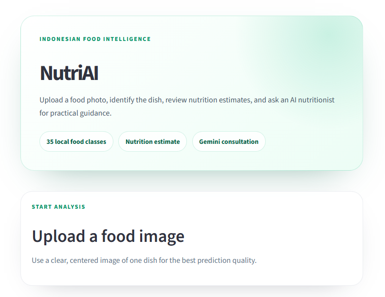
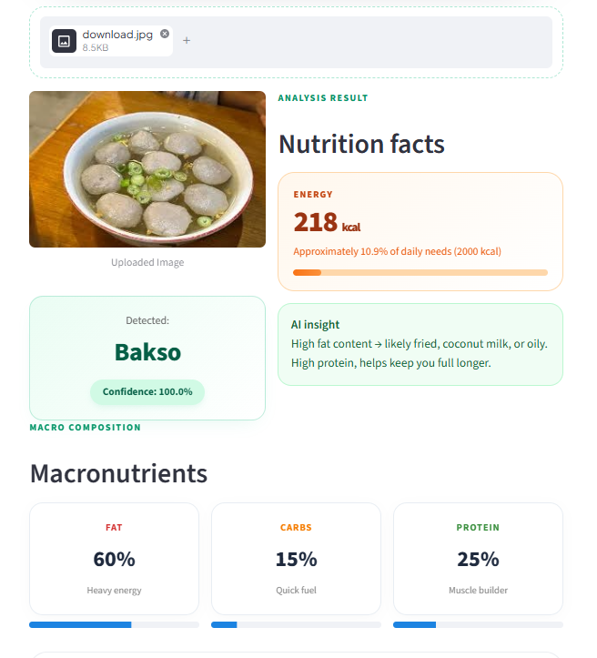
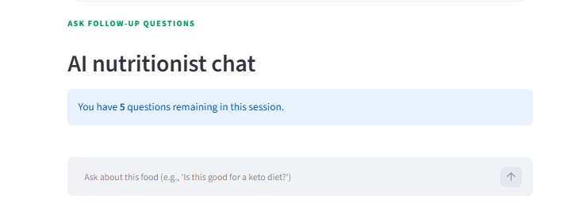

# NutriAI — Indonesian Food Recognition & Nutrition Intelligence

> Snap a photo of your meal. Know exactly what's in it. Ask an AI nutritionist.

Millions of Indonesians eat traditional food daily — but most nutrition apps only cover Western meals. NutriAI closes that gap: a deep learning model trained specifically on **35 Indonesian food classes**, paired with a conversational AI nutritionist powered by Gemini.

---

## Demo

<p align="center">
  
</p>

<p align="center">
  
</p>

<p align="center"><em>
  Bakso detected at 100% confidence — 218 kcal, 60% fat, 15% carbs, 25% protein. AI insight generated in context.
</em></p>

<p align="center">
  
</p>

<p align="center"><em>
  After detection, ask the AI nutritionist anything about the food: diet suitability, calorie burn, portion advice.
</em></p>

---

## The Problem

Indonesia has over 270 million people, yet:
- Obesity rates have nearly doubled in the last decade
- Most nutrition apps don't recognise Indonesian food at all
- Nutrition labels are missing from street food — which is where most people eat

NutriAI makes evidence-based nutrition accessible to anyone with a phone camera.

---

## What It Does

**1. Identify Indonesian food from a photo**
Upload any image. The CNN model classifies it against 35 Indonesian dishes (bakso, rendang, sate, nasi goreng, and more) and returns:
- Calories per standard portion
- Macronutrient breakdown (fat / carbs / protein)
- Percentage of daily calorie needs

**2. Ask an AI nutritionist follow-up questions**
After detection, a Gemini-powered chatbot automatically knows what food you just scanned:
> *"Is rendang safe if I'm on a keto diet?"*
> *"How much exercise burns off one portion of martabak manis?"*

**3. Confidence threshold filter**
Results below 45% confidence are suppressed and the user is guided to retake the photo — preventing misleading nutrition data.

---

## Model Architecture

Built with **TensorFlow / Keras** using a CNN architecture trained from scratch on a custom dataset of Indonesian food images.

- **Input size:** 320 × 320 pixels
- **Training augmentation:** rotation, zoom, horizontal flip
- **Dataset sources:** Kaggle + custom-collected data
- **Export formats:** `.keras`, `.h5`, `.tflite` (mobile-ready)

| Metric | Result |
|---|---|
| Classes | 35 Indonesian food categories |
| Model size | TFLite-optimised for mobile deployment |
| Confidence threshold | 45% (below this, no result is shown) |

See `Training Dataset/NutriAI_Model.ipynb` for full training details, accuracy curves, and confusion matrix.

---

## Tech Stack

| Layer | Technology |
|---|---|
| Model | TensorFlow 2.x, Keras (CNN) |
| Inference | `.keras` model, TFLite export |
| AI Chatbot | Google Gemini 2.0 Flash Lite |
| Frontend | Streamlit |
| Image processing | Pillow (PIL), NumPy |

---

## Quick Start

```bash
# 1. Clone and set up environment
git clone https://github.com/naufalhajid/NutriAI-Model.git
cd NutriAI-Model
python -m venv .venv
.venv\Scripts\activate  # Windows
# source .venv/bin/activate  # macOS/Linux

# 2. Install dependencies
pip install -r requirements.txt

# 3. (Optional) Enable Gemini chatbot
# Create .streamlit/secrets.toml and add:
# GEMINI_API_KEY = "your_api_key"

# 4. Run the app
streamlit run app.py
```

The app also works without a Gemini API key — food detection runs fully offline.

---

## Supported Food Classes

Ayam Geprek · Ayam Pop · Ayam Goreng · Bakso · Batagor · Bika Ambon · Cendol · Dadar Gulung · Dendeng · Gorengan · Gulai Ikan · Gulai Tambusu · Gulai Tunjang · Ikan Goreng · Ketoprak · Klepon · Kue Cubit · Martabak Manis · Martabak Telur · Mie Ayam · Nasi Goreng · Nasi Putih · Onde Onde · Pempek · Pepes Ikan · Pisang Ijo · Putu Ayu · Rendang · Roti Bakar · Sate Ayam · Soto Ayam · Sup Ayam · Telur Balado · Telur Dadar · Tempe Bacem

---

## License

MIT
